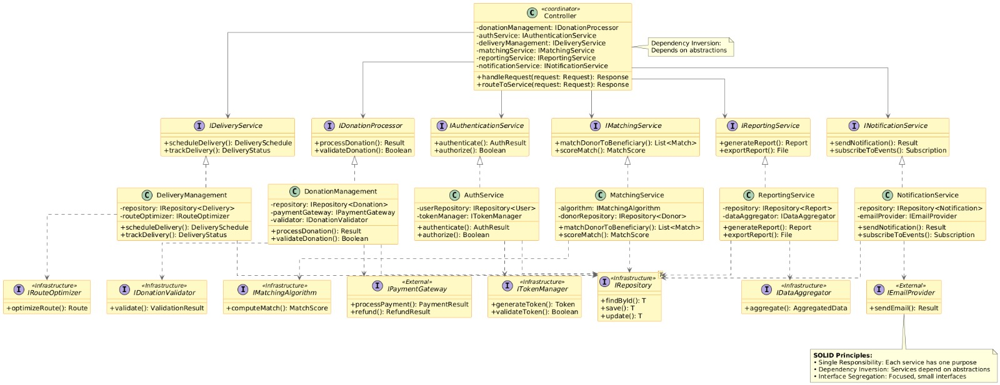

# 🍱 KheirBox - Food Donation Platform

KheirBox is a comprehensive food donation and redistribution platform that connects donors, receivers, volunteers, NGOs, and administrators to reduce food waste and help communities efficiently and safely.

## 🎯 Features

### User Management
- Multi-role registration (Donor, Receiver, Volunteer, NGO, Admin)
- JWT-based authentication
- Account approval workflow for sensitive roles
- User profile management

### Donation Management
- Create and manage food donations
- Real-time donation matching
- Recurring donation scheduling
- Expiry date tracking
- Location-based matching

### Volunteer & Delivery
- Browse available pickups
- Accept delivery assignments
- Real-time GPS tracking
- Safety checklists
- Receipt confirmation

### Gamification
- Points system for contributions
- Leaderboards
- Impact metrics (CO₂ reduction, meals donated)
- Badges and achievements

### Communication
- In-app notifications
- Real-time updates
- Multi-language support (English/Arabic)

### Admin Features
- User approval/rejection
- Report management
- Analytics dashboard
- System monitoring

## 🏗️ Architecture

The system follows a modern microservices architecture:

- **Backend**: Spring Boot 3.2 (Java 17)
- **Frontend**: Next.js 14 (React, TypeScript)
- **Database**: PostgreSQL 15
- **Authentication**: JWT (JSON Web Tokens)
- **Containerization**: Docker & Docker Compose

## 📋 Prerequisites

Before running the application, ensure you have the following installed:

- Docker (version 20.10 or higher)
- Docker Compose (version 2.0 or higher)
- Git

## 🚀 Quick Start

**New to KheirBox?** Check out our [📖 QUICKSTART Guide](QUICKSTART.md) for a 5-minute setup!

### 1. Clone the Repository

```bash
git clone <repository-url>
cd Fekra_soft
```

### 2. Start the Application

```bash
docker-compose up -d
```

This command will:
- Build the Spring Boot backend
- Build the Next.js frontend
- Start PostgreSQL database
- Initialize all services

### 3. Access the Application

- **Frontend**: http://localhost:3000
- **Backend API**: http://localhost:8080/api
- **Database**: localhost:5432

### 4. Default Credentials

Create an admin account following the instructions in [QUICKSTART.md](QUICKSTART.md#creating-the-first-admin-user).

## 📱 User Roles

### Donor
- Create food donations
- Manage donation listings
- Track donation status
- View impact metrics

### Receiver
- Browse available donations
- Request donations
- Confirm receipt
- Provide feedback

### Volunteer
- View available pickups
- Accept delivery tasks
- Track deliveries
- Update delivery status

### NGO
- Manage organization donations
- Generate reports
- Export data (CSV/PDF)
- View analytics

### Administrator
- Approve/reject users
- Monitor system activity
- Handle reports
- Manage platform settings

## 🛠️ Development Setup

### Backend Development

```bash
cd backend
mvn clean install
mvn spring-boot:run
```

### Frontend Development

```bash
cd frontend
npm install
npm run dev
```

### Database Access

```bash
docker exec -it kheirbox-db psql -U kheirbox -d kheirbox
```

## 📊 API Endpoints

### Authentication
- `POST /api/auth/register` - Register new user
- `POST /api/auth/login` - Login user

### Donations
- `GET /api/donations/available` - List available donations
- `GET /api/donations/my` - Get user's donations
- `POST /api/donations` - Create donation
- `PUT /api/donations/{id}` - Update donation
- `DELETE /api/donations/{id}` - Cancel donation

### Deliveries
- `GET /api/deliveries/available` - List available deliveries
- `GET /api/deliveries/my` - Get user's deliveries
- `POST /api/deliveries/{id}/accept` - Accept delivery
- `PUT /api/deliveries/{id}/status` - Update delivery status
- `POST /api/deliveries/{id}/confirm` - Confirm receipt

### Users
- `GET /api/users/me` - Get current user
- `GET /api/users/stats` - Get user statistics
- `GET /api/users/leaderboard` - Get leaderboard

### Notifications
- `GET /api/notifications` - Get user notifications
- `GET /api/notifications/unread-count` - Get unread count
- `PUT /api/notifications/{id}/read` - Mark as read

## 🔧 Configuration

### Backend Configuration

Edit `backend/src/main/resources/application.properties`:

```properties
# Database
spring.datasource.url=jdbc:postgresql://db:5432/kheirbox
spring.datasource.username=kheirbox
spring.datasource.password=kheirbox123

# JWT
jwt.secret=your-secret-key-here
jwt.expiration=86400000

# CORS
cors.allowed.origins=http://localhost:3000
```

### Frontend Configuration

Edit `frontend/.env.local`:

```env
NEXT_PUBLIC_API_URL=http://localhost:8080/api
```

## 🐳 Docker Commands

### Using Convenience Scripts

```bash
# Start the application
./start.sh

# Stop the application
./stop.sh

# View logs (all services)
./logs.sh

# View logs for specific service
./logs.sh backend
./logs.sh frontend
./logs.sh db
```

### Manual Docker Commands

```bash
# Start all services
docker-compose up -d

# Stop all services
docker-compose down

# View logs
docker-compose logs -f

# Rebuild and restart
docker-compose up -d --build

# Stop and remove volumes (WARNING: deletes all data)
docker-compose down -v
```

## 🧪 Testing

### Backend Tests

```bash
cd backend
mvn test
```

### Frontend Tests

```bash
cd frontend
npm run test
```

## 📝 Use Cases

Refer to `KheirBox .md` for detailed use cases:

1. **UC-1**: User Registration
2. **UC-2**: User Login
3. **UC-3**: Approve User Account
4. **UC-4**: Create Donation
5. **UC-5**: Edit/Cancel Donation
6. **UC-6**: Match Donation
7. **UC-7**: Accept Pickup
8. **UC-8**: Track Delivery
9. **UC-9**: Confirm Receipt
10. **UC-10**: Report Safety Issue
11. **UC-11**: View Impact & Rewards
12. **UC-12**: Generate Reports
13. **UC-13**: Send Notifications
14. **UC-14**: Provide Feedback

## 📐 System Architecture


## 🗂️ Class Diagram



## 🔐 Security

- JWT-based authentication
- Password encryption (BCrypt)
- Role-based access control (RBAC)
- CORS configuration
- SQL injection prevention (JPA)
- Input validation

## 🌍 Internationalization

The platform supports:
- English (en)
- Arabic (ar)

Language can be set during registration and changed in user settings.

## 📈 Performance

- Connection pooling (HikariCP)
- Database indexing
- Lazy loading for relationships
- Stateless authentication (JWT)
- Docker optimization

## 🤝 Contributing

1. Fork the repository
2. Create your feature branch (`git checkout -b feature/AmazingFeature`)
3. Commit your changes (`git commit -m 'Add some AmazingFeature'`)
4. Push to the branch (`git push origin feature/AmazingFeature`)
5. Open a Pull Request

## 📄 License

This project is licensed under the MIT License.

## 👥 Team

- Project: KheirBox
- Organization: Fekra Soft

## 📞 Support

For support, please create an issue in the repository or contact the development team.

## 🔄 Version

Current Version: 1.0.0

## 🎉 Acknowledgments

- Spring Boot community
- Next.js team
- PostgreSQL community
- Docker team
- All contributors and testers
